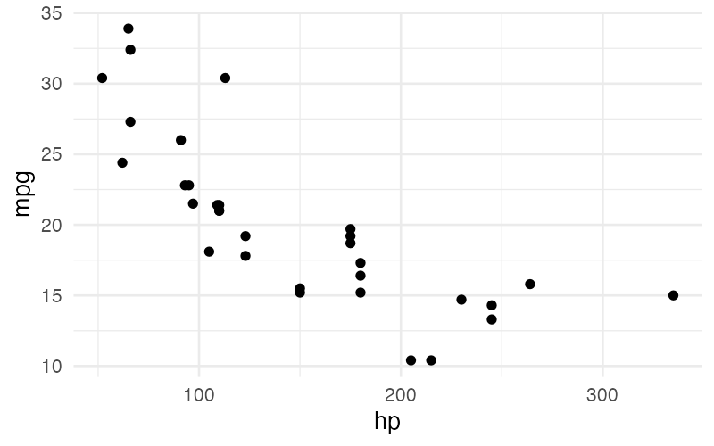
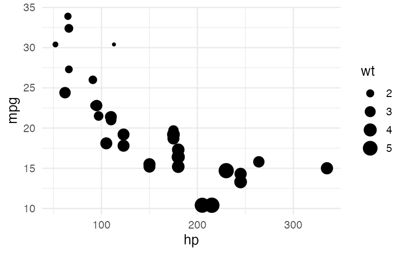
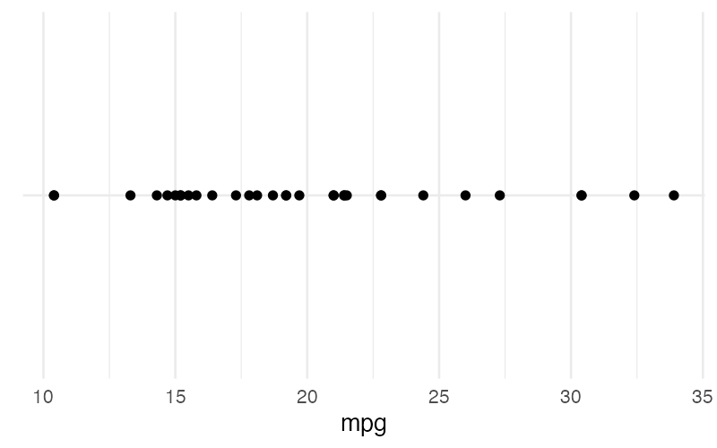
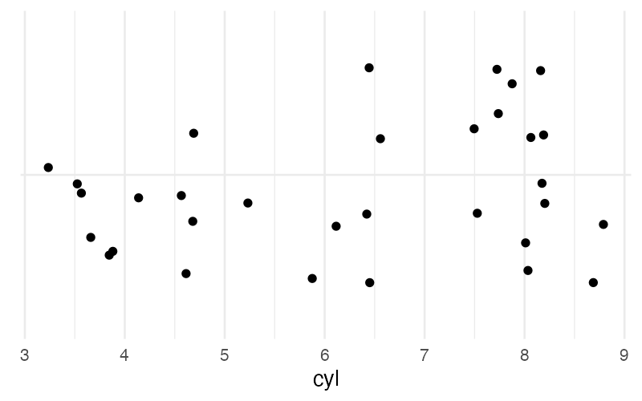
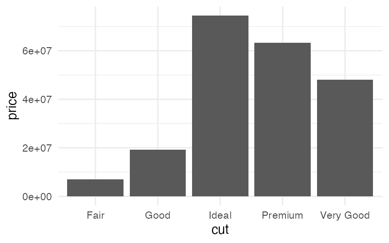
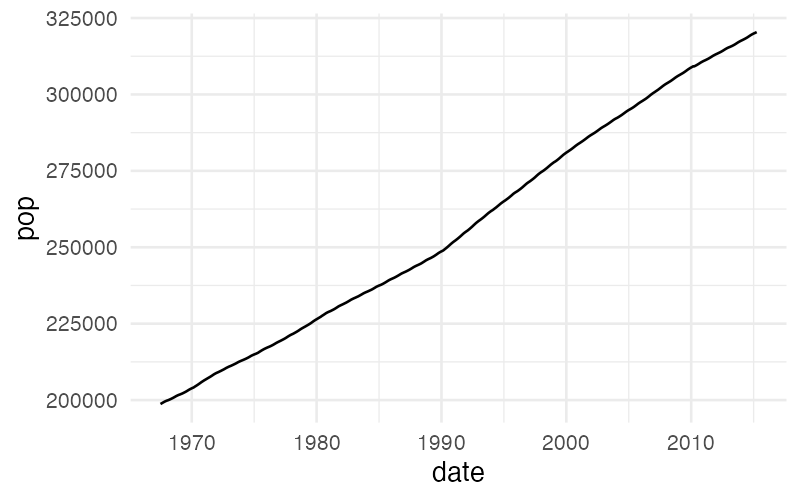
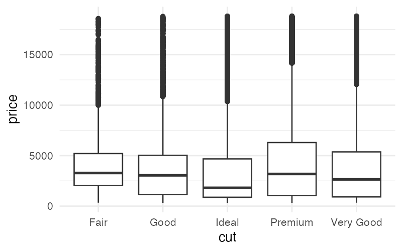
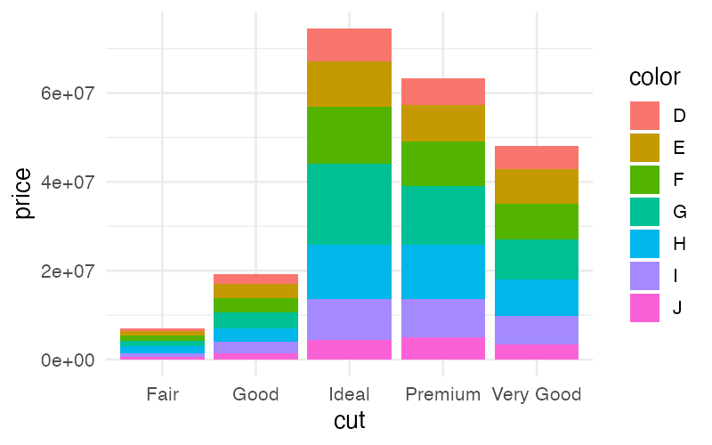
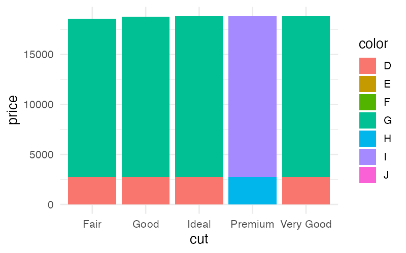
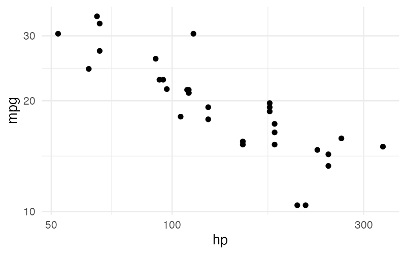

# Examples Gallery

SGL examples organized by category. Each example shows the SGL statement and its rendered output.

---

## Basic Plots

### Scatterplot

A simple scatterplot mapping two numerical columns to position.

```sql
visualize hp as x, mpg as y from cars using points
```



### Scatterplot with Color

Encode a third variable as point color.

```sql
visualize hp as x, mpg as y, cyl as color from cars using points
```


### Scatterplot with Size

Map a numerical column to point size.

```sql
visualize hp as x, mpg as y, wt as size from cars using points
```



### One-Dimensional Scatter

Map only one axis for a strip plot.

```sql
visualize mpg as x from cars using points
```



### Jittered Points

Reduce overplotting with random jitter.

```sql
visualize cyl as x from cars using jittered points
```



### Bar Chart

A bar chart with categorical x-axis and numerical y-axis.

```sql
visualize cut as x, price as y from diamonds using bars
```



### Line Chart

A time series displayed as a line.

```sql
visualize date as x, pop as y from economics using line
```



### Box Plot

Distribution of a numerical column across categories.

```sql
visualize cut as x, price as y from diamonds using boxes
```



---

## Aggregation

### Count Bar Chart

Count rows per category.

```sql
visualize cut as x, count(*) as y from diamonds group by cut using bars
```


### Histogram

Bin a numerical column and count occurrences.

```sql
visualize bin(mpg) as x, count(*) as y from cars group by bin(mpg) using bars
```


### Grouped Histogram

Compare distributions across categories with stacked colored bars.

```sql
visualize bin(mpg) as x, count(*) as y, cyl_cat as color
from (select *, cast(cyl as varchar) as cyl_cat from cars)
group by bin(mpg), cyl_cat
using bars
```


### Log-Spaced Histogram

Use a log scale for skewed distributions — bins are automatically log-spaced.

```sql
visualize bin(price) as x, count(*) as y from diamonds
group by bin(price)
using bars
scale by log(x)
```


---

## Multi-Series

### Stacked Bars with Color

Bars are stacked by default when a color aesthetic is present.

```sql
visualize cut as x, price as y, color as color from diamonds using bars
```



### Unstacked Bars

Place grouped bars side-by-side instead of stacking.

```sql
visualize cut as x, price as y, color as color from diamonds using unstacked bars
```



### Multi-Line Chart

Use `collect by` to draw multiple lines on the same plot.

```sql
visualize letter as x, number as y from synth collect by boolean using lines
```


---

## Advanced

### Scatterplot with Regression Line (Full Syntax)

Overlay a regression line on a scatterplot using explicit layers.

```sql
visualize hp as x, mpg as y from cars using points
layer
visualize hp as x, mpg as y from cars using regression line
```


### Scatterplot with Regression Line (Shorthand)

Same result with the shorthand `using (...)` syntax.

```sql
visualize hp as x, mpg as y from cars using (points layer regression line)
```


### Log Scale Scatterplot

Apply log transformation to axes.

```sql
visualize hp as x, mpg as y from cars using points scale by log(x), log(y)
```



### Faceted Scatterplot

Split a scatterplot into panels by a categorical variable.

```sql
visualize hp as x, mpg as y
from (select *, cast(cyl as varchar) as cyl_cat from cars)
using points
facet by cyl_cat
```


### Two-Dimensional Facet Grid

Facet by two variables — one horizontally, one vertically.

```sql
visualize hp as x, mpg as y
from (select *, cast(cyl as varchar) as cyl_cat,
                cast(am as varchar) as am_cat from cars)
using points
facet by cyl_cat horizontally, am_cat vertically
```


### Custom Titles

Override default axis and legend labels.

```sql
visualize hp as x, mpg as y, cyl as color from cars using points
title x as 'Horsepower', y as 'Miles Per Gallon', color as 'Cylinders'
```


### Pie Chart

Use polar coordinates with `theta`, `color`, and `count(*)`.

```sql
visualize count(*) as theta, cut as color from diamonds group by cut using bars
```


---

## Subqueries

### Filtered Scatterplot

Use a SQL subquery to filter rows before plotting.

```sql
visualize hp as x, mpg as y
from (select * from cars where mpg > 20)
using points
```


### Type Casting for Faceting

Cast a numerical column to categorical for use as a facet variable.

```sql
visualize hp as x, mpg as y
from (select *, cast(cyl as varchar) as cyl_cat from cars)
using points
facet by cyl_cat
```


