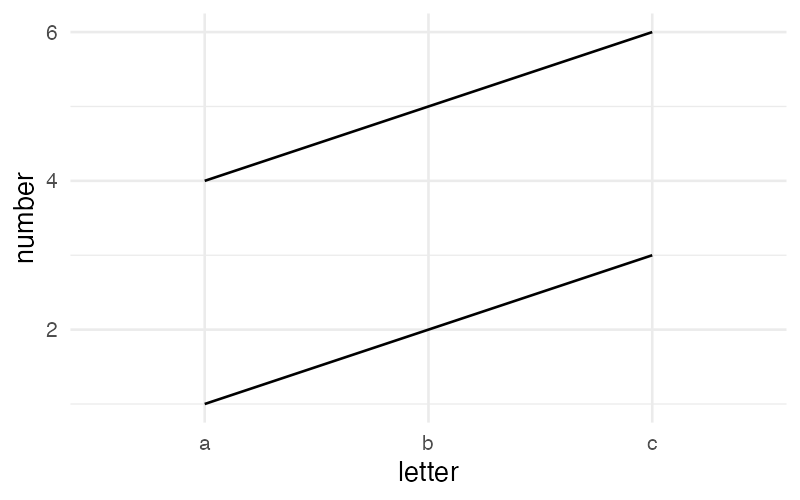

# Collections

The `collect by` clause groups rows into separate visual series without performing SQL aggregation. It is primarily used to create multi-line charts and grouped box plots.

## Syntax

```
collection_clause = "collect" "by" collection_list
collection_list   = col_expr { "," col_expr }
```

The `collect by` clause appears after `group by` (if present) and before `using`:

```sql
visualize letter as x, number as y from synth collect by boolean using lines
```

## What collect by Does

While [`group by`](grouping.md) performs SQL-level aggregation (combining rows with `count(*)`), `collect by` creates **visual groupings** — the data is drawn as separate series on the same plot. Collection columns map to the `group` aesthetic, which instructs the rendering engine to draw separate geometric objects for each group.

## Collective Geoms

Only **collective geoms** support `collect by`:

| Geom | Collective? |
|------|-------------|
| `point` / `points` | No |
| `bar` / `bars` | No |
| `line` / `lines` | Yes |
| `box` / `boxes` | Yes |

Using `collect by` with a non-collective geom produces an error.

## Examples

### Multi-Line Chart

The most common use of `collect by` is drawing multiple lines on the same plot:

```sql
visualize letter as x, number as y from synth collect by boolean using lines
```



Each unique value of the `boolean` column produces a separate line.

## Rules

### Without group by

When no `group by` clause is present, all collection expressions must be plain column names — CTAs like `bin()` or `count(*)` are not allowed:

```sql
-- Valid: plain column name
visualize letter as x, number as y from synth collect by boolean using lines

-- Invalid: cannot use bin() in collect by without group by
visualize letter as x, number as y from synth collect by bin(number) using lines
```

### With group by

When both `group by` and `collect by` are present:

1. **Non-positional groupings must be in collect by** — any grouping column that is not mapped to a positional aesthetic must appear in the `collect by` clause.
2. **Collections must have corresponding groupings** — every column in `collect by` must also appear in `group by`.
3. **Positional groupings cannot be collected** — grouping columns that are mapped to positional aesthetics (x, y, theta, r) cannot appear in `collect by`.

### Box Plot Collections

For box plots, the collection rules are more specific:

- Categorical or binned columns mapped to positional aesthetics must be included in an explicit collection.
- Numerical or temporal (unbinned) columns mapped to positional aesthetics cannot be included in a collection.
- Color mappings must have corresponding collections if an explicit collection is provided.

!!! note
    The distinction between `group by` and `collect by` is fundamental to SGL's design: `group by` answers "how should data be aggregated?" while `collect by` answers "how should data be visually separated?"
