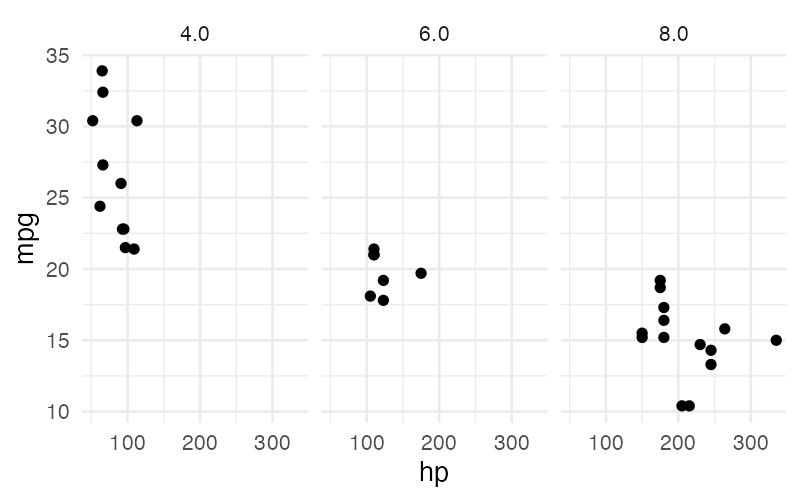
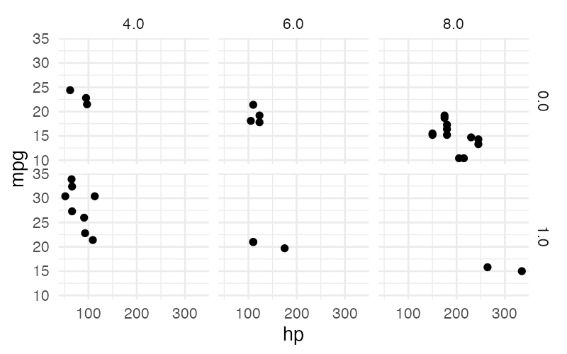

# Faceting

Faceting splits a plot into multiple panels based on the values of one or two categorical columns. Each panel shows a subset of the data, making it easy to compare patterns across groups.

## Syntax

```
facet_clause = "facet" "by" facet_list
facet_list   = facet_expr { "," facet_expr }
facet_expr   = identifier [ direction ]
direction    = "horizontally" | "vertically"
```

The `facet` clause appears after the last `using` clause (it is a graphic clause that applies globally):

```sql
visualize hp as x, mpg as y from cars using points facet by cyl_cat
```

## Single Facet (Wrapping)

With one facet column and no direction specified, panels wrap automatically:

```sql
visualize hp as x, mpg as y
from (select *, cast(cyl as varchar) as cyl_cat from cars)
using points
facet by cyl_cat
```



## Two-Dimensional Facet Grid

With two facet columns, specify `horizontally` and `vertically` to create a 2D grid of panels:

```sql
visualize hp as x, mpg as y
from (select *, cast(cyl as varchar) as cyl_cat,
                cast(am as varchar) as am_cat from cars)
using points
facet by cyl_cat horizontally, am_cat vertically
```



One column varies across columns (horizontally) and the other varies across rows (vertically).

## Rules

### Maximum Two Facets

SGL supports at most two facet expressions. Specifying three or more is an error.

### Direction Requirement for Two Facets

When two facet columns are specified, one must be `horizontally` and the other `vertically`. Having both as `horizontally` or both as `vertically` is an error.

!!! note
    For a single facet, the direction keyword is optional. When omitted, panels wrap automatically.

### Categorical Columns Only

Facet columns must be **categorical** type (VARCHAR, BOOLEAN, etc.) in all layers' data sources. Numerical and temporal columns cannot be used for faceting directly — use a [subquery](subqueries.md) to cast them first:

```sql
-- Cast numerical cyl to categorical before faceting
visualize hp as x, mpg as y
from (select *, cast(cyl as varchar) as cyl_cat from cars)
using points
facet by cyl_cat
```

### Column Must Exist

Facet columns must exist in at least one layer's data source.
