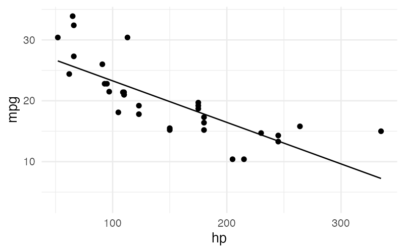

# Layering

Layering combines multiple geometric representations on the same plot. This is useful for overlaying different views of the same data — for example, showing both individual points and a trend line.

## Syntax

### Full Layer Syntax

Each layer is a complete `visualize ... from ... using ...` block, separated by the `layer` keyword:

```
layer_list = layer_expression { "layer" layer_expression }
```

```sql
visualize
  hp as x,
  mpg as y
from cars
using points
layer
visualize
  hp as x,
  mpg as y
from cars
using regression line
```


Each layer can have its own data source, aesthetic mappings, grouping, and collection clauses. The graphic clauses (`scale`, `facet`, `title`) apply globally across all layers.

### Shorthand Syntax

When layers share the same aesthetic mappings, data source, grouping, and collection clauses, use the parenthesized shorthand:

```
using_clause = "using" "(" layered_geom_list ")"
layered_geom_list = geom_expr { "layer" geom_expr }
```

```sql
visualize
  hp as x,
  mpg as y
from cars
using (points layer regression line)
```



This is equivalent to writing out the full form with identical mappings and data sources for each layer.

## How Shorthand Expands

The shorthand `using (geom1 layer geom2)` creates multiple layers that all share:

- The same aesthetic mappings from the `visualize` clause
- The same data source from the `from` clause
- The same `group by` clause (if present)
- The same `collect by` clause (if present)

Only the geom (and its modifier) differs between the expanded layers.

## Cross-Layer Validation Rules

When multiple layers are present (whether written explicitly or via shorthand), the following rules apply:

### Positional Aesthetic Consistency

If a positional aesthetic (`x`, `y`, `theta`, `r`) appears in one layer, it must appear in **all** layers:

```sql
-- Valid: both layers have x and y
visualize
  hp as x,
  mpg as y
from cars
using points
layer
visualize
  hp as x,
  mpg as y
from cars
using regression line
```

```sql
-- Invalid: first layer has x and y, second only has x
visualize
  hp as x,
  mpg as y
from cars
using points
layer
visualize
  hp as x
from cars
using points
```

### Type Consistency

The same aesthetic must be mapped to the same type (numerical, categorical, or temporal) across all layers. Additionally, date and datetime temporal types cannot be mixed for the same aesthetic across layers.

## Examples

### Scatterplot with Trend Line

The most common layering pattern — raw data as points with an overlaid regression line:

```sql
visualize
  hp as x,
  mpg as y
from cars
using (points layer regression line)
```


!!! tip
    The shorthand form is preferred when layers share all their clauses, as it avoids redundant repetition of mappings and data sources.
