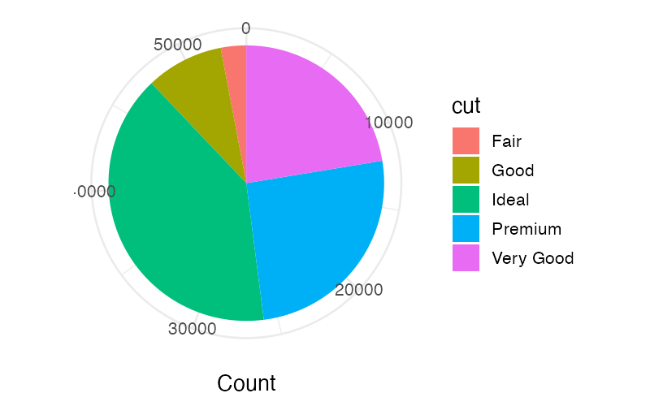

# Polar Coordinates

SGL supports polar coordinate plots by using the `theta` (angle) and `r` (radius) aesthetics instead of Cartesian `x` and `y`.

## Syntax

Polar aesthetics are used in the same way as Cartesian aesthetics:

```sql
visualize
  column as theta,
  column as r
from table
using geom
```

| Aesthetic | Description |
|-----------|-------------|
| `theta` | Angle position |
| `r` | Radius position |

## Coordinate System Constraint

Cartesian and polar aesthetics **cannot be mixed** within the same layer. A layer must use either `x`/`y` or `theta`/`r` — never both:

```sql
-- Valid
visualize
  count(*) as theta,
  cut as color
from diamonds
group by
  cut
using bars
```

```sql
-- Invalid: mixing x and theta
visualize
  hp as x,
  count(*) as theta
from cars
using points
```

## Pie Charts

The most common polar coordinate pattern is the pie chart. Combine `count(*)` as `theta` with a categorical `color` aesthetic and the `bars` geom:

```sql
visualize
  count(*) as theta,
  cut as color
from diamonds
group by
  cut
using bars
```



This works because:

1. `count(*)` produces a numerical value for each group — the slice size.
2. `theta` maps that value to an angle in polar coordinates.
3. `color` distinguishes the slices by category.
4. The `bars` geom, rendered in polar coordinates, produces wedge-shaped slices.

## One-Dimensional Polar Plots

Like Cartesian plots, polar plots can use just one positional aesthetic:

```sql
visualize
  count(*) as theta,
  cut as color
from diamonds
group by
  cut
using bars
```

Here only `theta` is specified — no `r` mapping.

## Rules

- At least one polar positional aesthetic (`theta` or `r`) must be present if using polar coordinates.
- Cannot mix with Cartesian aesthetics (`x`, `y`) in the same layer.
- All other SGL features (grouping, scales, titles, etc.) work the same with polar aesthetics.
- When titling polar aesthetics, use `theta` and `r` as the aesthetic names in the `title` clause.
