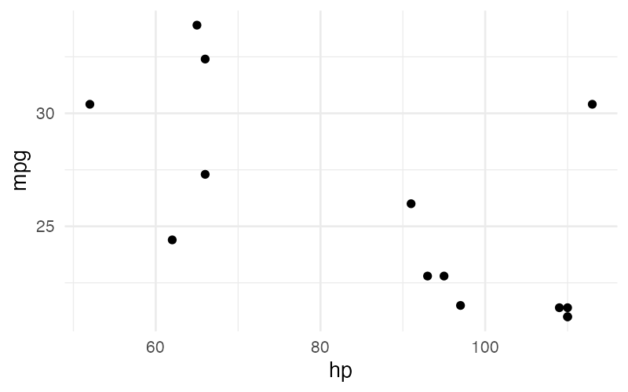

# Subqueries

The `from` clause accepts either a table name or a parenthesized SQL subquery. Subqueries allow preprocessing of data — filtering rows, casting types, or computing derived columns — before visualization.

## Syntax

```
from_clause = "from" table_name
            | "from" "(" sql_subquery ")"
```

When `from` is followed by an opening parenthesis `(`, everything up to the matching closing parenthesis `)` is captured as the SQL subquery text. Nested parentheses are tracked and balanced automatically.

```sql
visualize hp as x, mpg as y
from (select hp, mpg from cars where cyl = 4)
using points
```

## Common Use Cases

### Type Casting

Database columns sometimes have numerical types that should be treated as categories for visualization. Use a subquery to cast them:

```sql
visualize hp as x, mpg as y, cyl as color
from (select hp, mpg, cyl::varchar as cyl from cars)
using points
```

This is especially important for:

- **Faceting** — facet columns must be categorical, so numerical columns need casting.
- **Color encoding** — categorical colors produce discrete legends, while numerical colors produce continuous gradients.

### Filtering Rows

Select a subset of the data before plotting:

```sql
visualize hp as x, mpg as y
from (select * from cars where mpg > 20)
using points
```



### Derived Columns

Compute new columns for visualization:

```sql
visualize hp as x, mpg as y, cyl_cat as color
from (select hp, mpg, cast(cyl as varchar) as cyl_cat from cars)
using points
```

### Nested Parentheses

Subqueries can contain nested parentheses (e.g., for SQL function calls or sub-subqueries). The parser tracks parenthesis depth to find the correct closing parenthesis:

```sql
visualize hp as x, mpg as y
from (select hp, mpg from cars where cyl in (4, 6))
using points
```

## SQL Dialect

The SQL inside a subquery is passed directly to the database. The SQL dialect depends on which database the implementation connects to (e.g., DuckDB SQL, PostgreSQL, SQLite). SGL does not parse or validate the subquery SQL — it simply passes the text through.

!!! tip
    Keep subqueries simple — filter, cast, and rename columns. Complex SQL logic is better handled outside of SGL, with the results stored in a table or view that SGL can reference by name.
