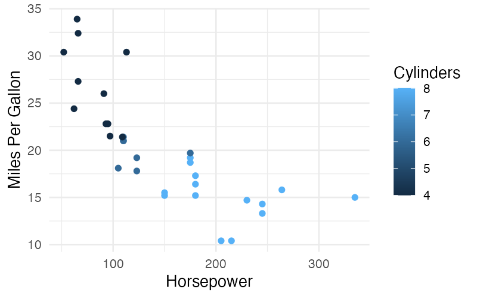

# Titles

The `title` clause overrides the default axis and legend labels with custom text.

## Syntax

```
title_clause = "title" title_list
title_list   = title_expr { "," title_expr }
title_expr   = aesthetic_name "as" single_quoted_string
```

The `title` clause appears after the last `using` clause (it is a graphic clause that applies globally):

```sql
visualize hp as x, mpg as y from cars using points
title x as 'Horsepower', y as 'Miles Per Gallon'
```

## String Literals

Title labels use **single-quoted strings**:

- Delimited by single quotes: `'My Label'`
- To include a literal single quote, escape it with a backslash: `\'`

```sql
title x as 'Engine\'s Power'
```

## Examples

### Labeling Axes

```sql
visualize hp as x, mpg as y, cyl as color from cars using points
title x as 'Horsepower', y as 'Miles Per Gallon', color as 'Cylinders'
```



### Labeling a Single Axis

Titles can be set for individual aesthetics without titling all of them:

```sql
visualize hp as x, mpg as y from cars using points
title x as 'Horsepower'
```

## Default Titles

When no explicit title is provided for an aesthetic, SGL generates a default label:

| Mapping | Default Title |
|---------|---------------|
| Plain column (e.g., `mpg as x`) | Column name (`mpg`) |
| `count(*) as y` | `Count` |
| `bin(mpg) as x` | `Binned mpg` |

## Rules

### Aesthetic Must Exist

You can only title aesthetics that appear in at least one layer's aesthetic mappings:

```sql
-- Invalid: 'size' is not mapped in any layer
visualize hp as x, mpg as y from cars using points title size as 'Weight'
```

### Titleable Aesthetics

All six aesthetics can receive titles: `x`, `y`, `color`, `size`, `theta`, `r`.

!!! note
    For bar charts, the `color` title applies to the fill legend (since bar `color` maps to fill internally).
