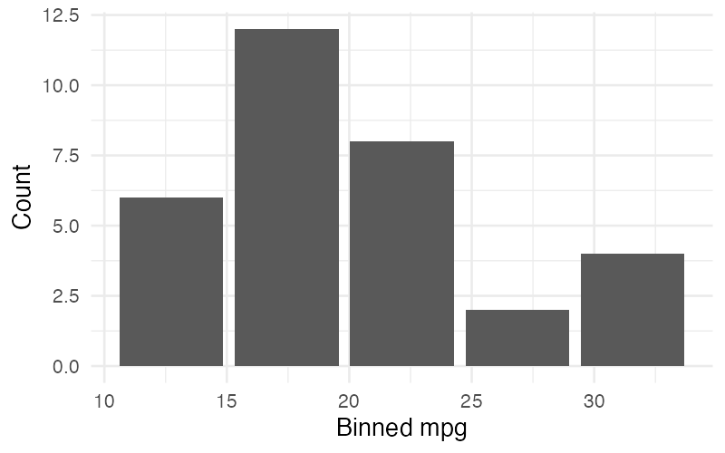
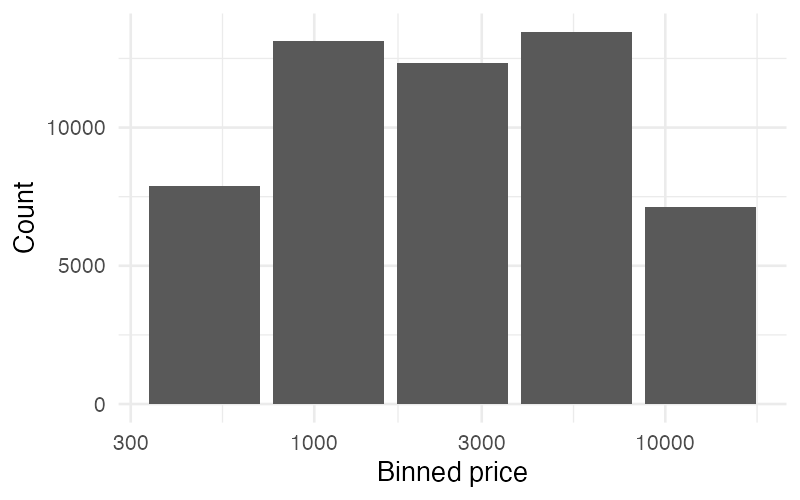
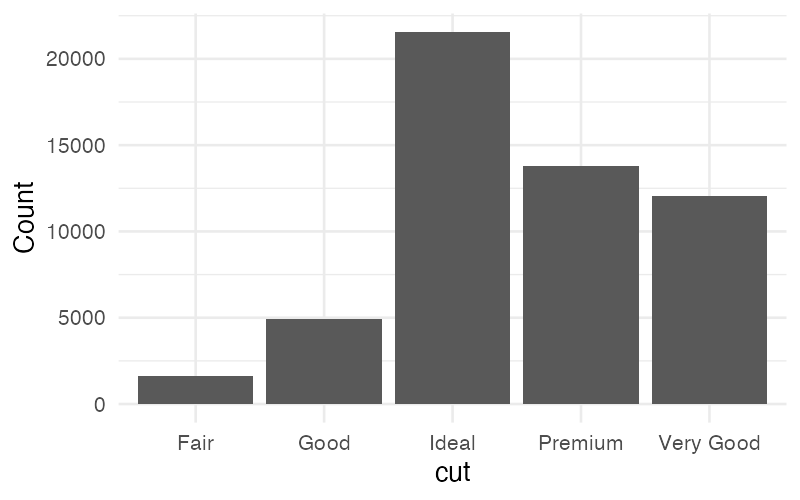
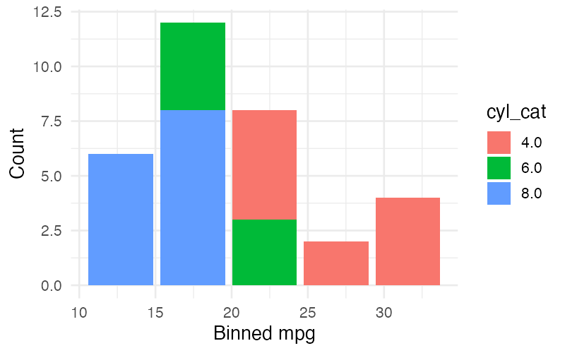

# Column Transformations

SGL provides two Column Transformations and Aggregations (CTAs) that can be applied to columns within aesthetic mappings and grouping expressions: `bin()` for discretizing numerical data and `count(*)` for counting rows.

## Syntax

```
col_expr = identifier
         | identifier "(" identifier ")"
```

CTAs are used in place of plain column names wherever a column expression is expected:

```sql
visualize
  bin(mpg) as x,
  count(*) as y
from cars
group by
  bin(mpg)
using bars
```

---

## bin(column)

The `bin()` transformation discretizes a numerical column into **5 equal-width buckets**. Each value is replaced by the center of its bucket.

### How Binning Works

1. The column's range is computed (min to max, with a small padding).
2. The range is divided into 5 equal-width intervals.
3. Each value is assigned to its interval and replaced by the interval's center point.

### Usage

`bin()` is typically paired with `count(*)` to create histograms:

```sql
visualize
  bin(mpg) as x,
  count(*) as y
from cars
group by
  bin(mpg)
using bars
```



### Constraints

- `bin()` can only be applied to **numerical** or **temporal** columns. Applying it to a categorical column produces an error. The binning algorithm is designed for numerical data; applying it to temporal columns is permitted but may not produce meaningful results.
- Binned columns are treated as categorical/binned for validation purposes (e.g., they satisfy the "one categorical, one numerical" constraint for bars).

### Log-Spaced Binning

When a binned axis also has a `log` [scale](scales.md), bins are computed in log-space rather than linear space. This produces buckets that are equal-width on the log-transformed axis:

```sql
visualize
  bin(price) as x,
  count(*) as y
from diamonds
group by
  bin(price)
using bars
scale by
  log(x)
```



---

## count(*)

The `count(*)` aggregation counts the number of rows per group. It is the only aggregation function in SGL.

### Usage

`count(*)` is always used with `*` as its argument — it cannot be applied to a specific column name.

```sql
visualize
  cut as x,
  count(*) as y
from diamonds
group by
  cut
using bars
```



### Constraints

- `count()` can **only** be applied to `*`. Writing `count(mpg)` is an error.
- When `count(*)` is used, a [`group by`](grouping.md) clause is required (unless `count(*)` is the only aesthetic mapping).
- `count(*)` is always treated as a numerical type.

---

## Combining bin and count

The most common CTA pattern is combining `bin()` and `count(*)` to produce histograms:

```sql
visualize
  bin(mpg) as x,
  count(*) as y
from cars
group by
  bin(mpg)
using bars
```

The `bin()` transformation discretizes the column, and `count(*)` counts the number of original rows that fall into each bin. The `group by` clause must include the `bin()` expression.

### Grouped Histogram

Add a `color` aesthetic (also in `group by`) to compare distributions across categories:

```sql
visualize
  bin(mpg) as x,
  count(*) as y,
  cyl_cat as color
from (select *, cast(cyl as varchar) as cyl_cat from cars)
group by
  bin(mpg),
  cyl_cat
using bars
```



!!! tip
    When comparing distributions by color, consider using `unstacked bars` to place groups side-by-side instead of stacking them.
