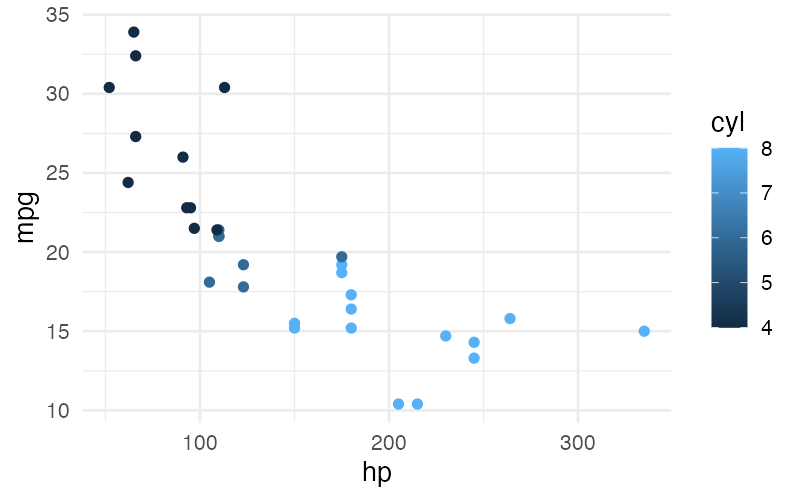

# SGL — Structured Graphics Language

SGL is a declarative, SQL-like language for generating data visualizations directly from database tables. Instead of writing plotting code in R, Python, or JavaScript, you write a single SGL statement that describes what you want to see — which columns map to which visual properties, the data source, and the type of chart — and an SGL implementation renders the plot.

SGL is designed to be **portable across implementations**. The same statement produces equivalent visualizations whether you're using the [R implementation](implementations.md), a future Python package, or any other host environment. This site documents the language itself, independent of any specific implementation.

For the academic foundations, see the [original paper on arXiv](https://arxiv.org/abs/2505.14690).

## A Taste of SGL

```sql
visualize hp as x, mpg as y, cyl as color from cars using points
```



This single statement produces a scatterplot with horsepower on the x-axis, miles per gallon on the y-axis, and points colored by cylinder count — all drawn directly from a `cars` table in a connected database.

## Where to Go Next

- **[Getting Started](getting-started.md)** — Learn the basics with progressive examples
- **[Language Reference](reference.md)** — Complete grammar and semantic specification
- **[Features](features/aesthetics.md)** — Deep dives into each SGL feature
- **[Examples Gallery](examples.md)** — A curated collection of SGL visualizations
- **[Implementations](implementations.md)** — Available SGL implementations
